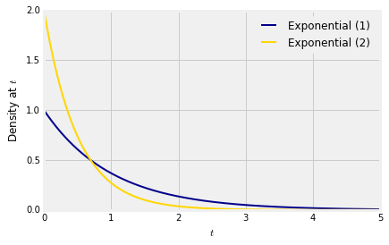
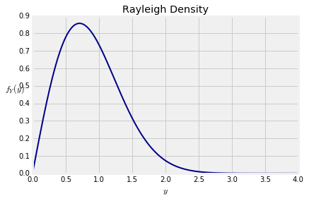
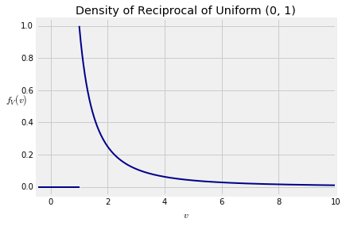
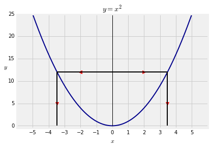

# 十六、变换

令 $X$ 有一个连续的分布，令 $Y=g(X)$ 是 $X$ 的函数。在期望存在的情况下，我们知道怎么计算 $E(Y)$。本章，我们将会学会一种从 $g$ 和 $X$ 的概率密度求解 $Y$ 的概率密度的方法。

这种方法只能用于一些“行为好”的函数 $g$。我们会在文中定义什么是“行为好”。事实上，“行为好”的函数已经相当丰富了了，已经包含了我们感兴趣的随机变量的一大部分。

我们将会从学习指数分布开始，这已经在前面的章节介绍过了。我们将会认识到所有的指数分布的随机变量都是其中一个的线性变换。这个结论将会引导我们得到一个关于随机变量概率密度函数的一般公式。

## 线性变换

令 $T$ 服从参数为 $\lambda$ 的指数分布，再令 $T_1=\lambda T$，那么 $T_1$ 就是 $T$ 的线性变换，有：
$$E(T_1) = \lambda E(T)\ 和\ SD（T_1)=\lambda SD(T)=1$$
参数 $\lambda$ 在求期望和标准差时消失了，让我们从 $T_1$ 的分布看看这是如何实现的。$T_1$ 的累计概率密度函数为：
$$F_{T_1}(t)=P(T_1 \leq t)=P(T \leq t/\lambda)=1-e^{-\lambda(t/\lambda)}=1-e^{-t}$$
这是参数为1的指数分布，与上面计算得到的期望和标准差一致。总结如下，如果 $T$ 服从参数为 $\lambda$ 的指数分布，那么 $T_1=\lambda T$ 服从参数为1的指数分布。

你可以把参数为1的指数分布看作是指数分布系中的一个基本成员，系中的其他成员都可以通过乘以一个常数，缩放变换得到。

### 缩放参数

相反地，如果 $T_1$ 服从参数为1的指数分布，那么 $T=\frac{1}{\lambda}$ 就变成了参数为 $\lambda$ 的指数分布，因子 $1/\lambda$ 称为缩放参数。

下图是 $T_1$ 和 $T=\frac{1}{2}T_1$ 概率密度图。我们知道 $T$ 是参数为2的指数分布。

这两个概率密度函数为：
$$f_{T_1}(s)=e^{-s}\ \ \ f_{T}(t)=2e^{-2t}$$
让我们用一种便于推广的方式尝试理解一下这两个概率密度的关系。

随机变量 $T$ 和 $T_1$ 的关系是 $T=\frac{1}{2}T_1$。
- 对于任意 $t$ ，$T$ 等于 $t$ 的几率与 $T_1$ 等于 $s=2t$ 的几率相同，因此 $e^{-2t}$ 是 $T$ 的概率密度。
- 如果我们把 $T_1$ 当做水平轴上的一个点，然后去找 $T$ 的话需要把 $T_1$ 除以2。这个变换对水平轴上的所有点都做了这样的处理。为了保持 $T$ 的概率密度曲线包围的面积为1，我们必须把垂直轴的距离乘以2。这就是 $T$ 概率分布函数前面有因子2的原因。

### 概率密度函数的线性变换

我们使用同样的思想来求解一个随机变量经过线性变换后的的概率密度公式。

令 $X$ 是一个随机变量，有着概率密度 $f_X$，令 $Y=aX+b$，$a, b$ 为常数，且 $a\neq 0$。令 $f_Y$ 为 $Y$ 的概率密度。有：
$$f_Y(y)=f_X(\frac{y-b}{a})\frac{1}{|a|}$$

像指数分布例子中的那样，我们把公式分为两部分，。
- 对于 $Y$ 变成 $y$, $X$ 需要变为 $(y-b)/a$。
- 线性函数 $y=ax+b$ 沿着水平轴对距离乘以 $|a|$（$a$的符号不影响距离）。为了维持概率密度函数包围的面积为1，我们需要对纵轴的距离除以 $|a|$ 加以补偿。

这是理解公式的一种很好的方式，能够帮助你理解非线性变换的对应公式。

先从 $a > 0$ 证明公式：
$$F_Y(y)=P(aX+b\leq y)=P(X\leq \frac{y-b}{a})=F_X(\frac{y-b}{a})$$
根据微分的链式法则有：
$$f_Y(y)=f_X(\frac{y-b}{a})\cdot\frac{1}{a}$$
如果 $a < 0$，除以 $a$ 需要改变不等号的方向：
$$F_Y(y)=P(aX+b\leq y)=P(X\geq \frac{y-b}{a})=1-F_X(\frac{y-b}{a})$$
根据链式法则导出：
$$f_Y(y)=-f_X(\frac{y-b}{a})\cdot\frac{1}{a}=f_X(\frac{y-b}{a})\cdot\frac{1}{|a|}$$

### 正态分布

令 $Z$ 服从标准正态分布
$$\phi(z)=\frac{1}{\sqrt{2\pi}}e^{-\frac{1}{2}z^2}, -\infty<z<\infty$$

令 $X=\sigma Z+\mu$，$u$ 和 $\sigma$ 均为常数，且 $\sigma > 0$。对于任意实数 $x$，$X$的概率密度为：
\begin{align}
f_X(x) &= \phi(\frac{x-u}{\sigma})\frac{1}{\sigma} \\
&= \frac{1}{\sqrt{2\pi}\sigma}e^{-\frac{1}{2}(\frac{x-\mu}{\sigma})^2}
\end{align}
因此，每个正态分布变量都是标准正态分布变量的一个线性变换。

### 均匀分布密度函数，回顾

令 $U$ 的分布为在区间 $(0, 1)$ 的均匀分布，对于常数 $a, b$，且 $b>a$，令 $V=(b-a)U+a$。在更早的章节中，我们看到 $V$ 是区间 $(a, b)$ 之间的均匀分布。现在让我们使用新学到的知识证明一下这个结果。

首先，需要明确 $V$ 的可能取值。因为 $U$ 的可能值在区间 $(0, 1)$ 之间，$V$ 的可能值在 $(a, b)$ 之间。

对于 $v\in(a, b)$，$V$的概率密度为：
$$f_V(v) = f_U(\frac{v-a}{b-a})\frac{1}{b-a} = 1\cdot\frac{1}{b-a} = \frac{1}{b-a}$$
这是区间 $(a, b)$ 之间的均匀分布概率密度函数。

## 单调函数

我们求解一个随机变量经过线性变换后的概率密度函数的方法可以拓展到非线性变换上。你已经见识过对一个随机变量进行非线性变换可以得到有用的结果，我们先从这里开始。

### 通过累计概率密度函数（CDF）模拟

在练习中，你已经看到借助某一个分布的累计概率密度函数和一个 $(0, 1)$ 之间均匀分布的随机数，可以模拟生成该分布的随机数。现在，我们建立一个理论来突出这个计算过程中的重点。

令 $F$ 是可微的，累计概率分布函数是严格单增的。可微的假设让你可以通过微分求解概率密度函数。

我们的目标是生成一个随机数，它的累计概率分布函数是 $F$。下面的陈述描述了你在练习中使用的处理过程。注意因为 $F$ 是连续并且严格递增的，它有反函数。

令 $U$ 满足 $(0, 1)$ 之间的均匀分布。通过公式 $X=F^{-1}(U)$ 定义一个随机变量 $X$，令 $F_X$ 为 $X$ 的累计概率分布函数。我们将看到 $F_X=F$，因此 $X$ 满足所要的分布。

想要证明结论，需要记住 $U$ 的累计概率密度函数 $F_U$ 是 $F_U(u)=u$ ，$0<u<1$。令 $x$ 为任意数。我们的目标是证明 $F_X(x)=F(x)$。
\begin{align}
F_X(x) &= P(X\leq x) \\
&= P(F^{-1}(U)\leq x) \\
&= P(U\leq F(x))\ 因为F是单增的 \\
&= F_U(F(x)) \\
&= F(x)
\end{align}

### 单增函数概率密度函数的变化

函数 $F^{-1}$ 是可微的、单增的。我们现在拓展一种通用的方法来求解这样一个函数应用在一个随机变量上后的概率密度函数。

令 $X$ 有概率密度函数 $f_x$。令 $g$ 为一个平滑的（意味着可微）单增的函数，令 $Y=g(X)$。举一些函数函数 $g$ 的例子：
- $g(x)=ax+b, a>0$，这个例子之前的章节提到了。
- $g(x)=e^x$
- $g(x)=\sqrt{x}, x>0$

为了从 $f_x$ 和 $g$ 得到 $Y$ 的概率密度函数，我们将从累计概率分布函数开始，就像我们前面做的那样。

令 $g$ 是一个平滑而且单增的，令 $Y=g(X)$。我们想得到 $f_Y$ 的公式。我们将根据 $g$ 和 $X$ 的概率密度函数 $F_X$，从求解 $Y$ 的累计概率密度函数 $F_Y$ 开始。
\begin{align}
F_Y(y) &= P(Y\leq y) \\
&= P(g(X)\leq y) \\
&= P(X\leq g^{-1}(y))\ 因为g是单增的 \\
&= F_X(g^{-1}(y))
\end{align}

现在我们可以通过微分得到 $Y$ 的概率密度函数。通过链式法则和逆函数的导数等于导数的倒数的事实：
\begin{align}
f_Y(y) &= f_X(g^{-1}(y))\frac{d}{dy}g^{-1}(y) \\
&= f_X(x)\frac{1}{g'(x)}\ at\ x=g^{-1}(y)
\end{align}

### 公式

令 $g$ 是一个可微的单增的函数， $Y=g(X)$ 的概率密度函数通过下式给出：
$$f_Y(y) = f_X(x)\cdot \frac{1}{g'(x)}\ at\ x=g^{-1}(y)$$

### 理解公式

想理解计算过程中发生了什么，我们将沿着与之前线性函数章节使用过的同样的处理过程。
- 对于 $Y$ 变成 $y$，$X$ 需要变成 $g^{-1}(y)$
- 由于 $g$ 不必是线性，通过 $g$ 的变换不一定会以一个常数因子伸缩水平轴。相反，这个因子在每个 $x$ 处都有不同的值。如果 $g'$ 表示 $g$ 的倒数，那么在 $x$ 处的伸缩因子就是 $g'(x)$，就是 $g$ 在 $x$ 处变化的速率。为了使概率密度函数下面的总面积为1，我们必须除以 $g'(x)$ 进行补偿。这是有根据的，因为 $g$ 是增加的，因此 $g'$ 是正的。

这给了我们一个公式的直观的证明。

### 应用公式

令 $X$ 服从参数为1的指数分布，令 $Y=\sqrt{X}$。我们可以取一个平方根，因为 $X$ 是一个正的随机变量。

让我们通过应用之前推导的公式来得到 $Y$ 的概率密度函数。我们将通过四个初步步骤进行计算，然后代入公式：
- 函数：使 $g(x)=\sqrt{x}$，然后 $g$ 是单增的，它的正值的范围为 $(0, \infty)$。
- 求导：$g$ 的导数为 $g'(x)=1/2\sqrt{x}$。
- 反函数：令 $y=g(x)=\sqrt{x}$。我们现在将通过 $y$ 写 $x$，得到 $x=y^2$。
- 已知的概率密度函数：$X$ 的概率密度是 $f_X(x)=e^{-x}$，对于 $x>0$。

我们现在准备好代入公式了，始终记住 $Y$ 的可能值为 $(0, \infty)$，对于 $y>0$ 公式：
$$f_Y(y)=f_X(x)\cdot \frac{1}{g'(x)}\ at\ x=g^{-1}(y)$$
因此对于 $y>0$ 
\begin{align}
f_Y(y) &= e^{-x}\cdot \frac{1}{1/2\sqrt{x}}\ at\ x=y^2 \\
&= 2\sqrt{x}e^{-x}\ at\ x=y^2 \\
&= 2\sqrt{y^2}e^{-y^2} \\
&= 2ye^{-y^2}
\end{align}

这是瑞利概率密度函数，它的图展示在下面：

一个对数正态分布可以用来当做大量的独立同分布的（i.i.d.）随机变量乘积的概率密度函数。乘积的对数是大量的独立同分布的变量的和，因此根据中心极限定理是近似正态。

### 密度公式的变化：单调函数

令 $g$ 是平滑的、单调的（意味着单增或者是单减）。$Y=g(X)$ 的概率密度函数通过下式给定：
$$f_Y(y) = f_X(x)\cdot\frac{1}{|g'(x)|}\ at\ x=g^{-1}(y)$$

我们已经证明当 $g$ 是单增的情况。当 $g$ 单减时，证明与线性情况类似，此时 $g'(x)$ 是负值。我们就不再花时间把它写出来。

### 均匀变量的倒数

令 $U$ 为区间 $(0, 1)$ 的均匀分布，令 $V=1/U$。$V$ 的分布被称为*反均匀分布*，但是词“反”在变量变化的上下文中很容易困惑。因此我们简单地称 $V$ 是 $U$ 的倒数。

想要得到 $V$ 的概率密度函数，需要先注意到 $V$ 的取值范围为 $(1, \infty)$，因为 $U$ 的取值范围在 $(0, 1)$。

概率密度函数变化的各个部分：
- 函数：定义 $g(u)=1/u$
- 导数：$g'(u)=-u^{-2}$
- 反函数：令 $v=g(u)=1/u$，然后有 $u=g^{-1}(v)=1/v$
- 已知的概率密度函数：$f_U(u)=1,\ 0<u<1$。

根据这个公式，对于 $v>1$，我们有：
$$f_V(v)=f_U(u)\cdot\frac{1}{|g'(u)|}\ \ 在u=g^{-1}(v)$$
这是对于 $v>1$
$$f_V(v)=1\cdot u^2\ \ 在u=1/v$$
因此
$$f_V(v)=\frac{1}{v^2},\ \ v>1$$

你应该检查一下 $f_V$ 确实是一个概率密度函数，看它的积分是否为1。你也应该检查一下 $V$ 的期望是不是无穷大。

$f_V# 的概率密度函数属于柏拉图系，在经济学中用的很多。

## 二对一的函数

令 $X$ 有概率密度函数 $f_x$。像前面看到的那样，随机变量 $Y=X^2$ 在计算中经常被提到。我们需要的是 $E(Y)$，这可以通过 $X$ 的非线性函数的期望公式找到。想要得到 $Y$ 的概率密度函数，我们不能直接使用上一节那样的变量代换，因为函数 $g(x)=x^2$ 不是单调的。它是二对一的，因为 $-\sqrt{x}$ 和 $\sqrt{x}$ 的平方一样。

这节，我们通过修改单调函数 $X$ 的概率密度函数来求解 $Y$ 的概率密度函数。这个可以直接拓展到二对一或者多对一的函数。

### $Y=X^2$ 的概率密度函数

如果 $X$ 既能取正值又能取负值，我们必须考虑到这样一种情况，事件 $\{U\in dy\}$ 可能发生在两种相互排斥的情况下：无论是 $X$ 接近 $y$ 的正的平方根还是接近 $y$ 的负的平方根。

因此 $Y$ 在 $y$ 处的概率密度有两部分。对于 $y>0$
$$f_Y(y)=a+b$$
其中，$a=f_X(x_1)\cdot\frac{1}{2x_1}\ \ 在x_1=\sqrt{y}处$，$b=f_X(x_2)\cdot\frac{1}{|2x_2|}\ \ 在x_2=-\sqrt{y}处$

当 $g(x)=x^2$ 时，$g'(x)=2x$。

一个更正规的方法是从 $Y$ 的累计概率密度函数开始算起：
\begin{align}
F_Y(y) &= P(Y\leq y) \\
&= P(|X|\leq \sqrt{y}) \\
&= P(-\sqrt{y}\leq X \leq \sqrt{y}) \\
&= F_X(\sqrt{y}) - F_X(-\sqrt{y})
\end{align}

两边微分得到了 $f_Y(y)$ 的公式；注意一下第二项有两个减号，确保你正确地结合它们。

这种方法可以拓展到任何多对一的函数 $g$，对于每个 $y$，每个 $x$ 值都有一个分量使 $g(x)=y$。

### 标准正态分布的平方

令 $Z$ 为标准正态分布，令 $W=Z^2$。$W$ 的可能取值非负。对于一个大于零的值 $w\leq 0$，推导的公式告诉我们 $W$ 的概率密度函数通过下式给定：
\begin{align}
f_W(w) &= f_Z(\sqrt{w})\cdot \frac{1}{2\sqrt{w}}+f_Z(-\sqrt{w})\cdot \frac{1}{2\sqrt{w}} \\
&= \frac{1}{\sqrt{2\pi}}e^{-\frac{1}{2}w}\cdot \frac{1}{2\sqrt{w}}+\frac{1}{\sqrt{2\pi}}e^{-\frac{1}{2}w}\cdot \frac{1}{2\sqrt{w}} \\
&= \frac{1}{\sqrt{2\pi}}w^{-\frac{1}{2}}e^{-\frac{1}{2}w}
\end{align}

通过代数，概率密度函数可以写成一个我们将会经常用到的等式的形式：
$$f_W(w)=\frac{\frac{1}{2}^\frac{1}{2}}{\sqrt{\pi}}w^{\frac{1}{2}-1}e^{-\frac{1}{2}w}$$

这是伽马概率密度函数系的一员，我们之后将会学到。在统计学，它被称为自由度为1的卡方分布。